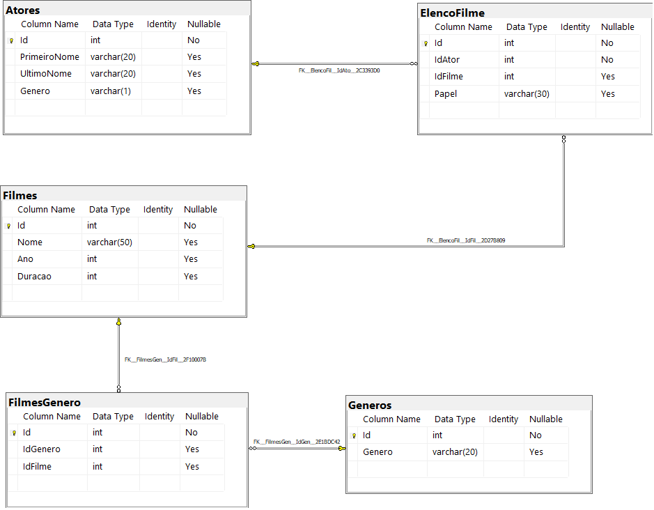

# Banco de Dados Relacional com SQL Server

Um **Banco de Dados** é uma coleção organizada de informações estruturadas armazenadas em algum local.

Neste programa é implementado um Banco de Dados **Relacional**, que é o tipo mais usado atualmente, armazenando dados estruturados, sendo organizado em tabelas com colunas e linhas que se _relacionam entre si_.

### DBMS - Database Menagement System ⚙️

É um software utilizado para acessar, manipular e monitorar um sistema de banco de dados. É a maneira visual de manipular o banco de dados, pois ele sozinho é só um serviço. ⇒ Como se fosse uma IDE para acessar o banco de dados.

**Database:** é uma coleção de dados estruturados, agrupados de forma concisa. É composto de tabelas, procedures, views, etc. ⇒ É o banco de dados com tabelas separadas por contextos.

## Programa 🗂️

Este é o banco de dados de um site de filmes, onde são armazenados dados sobre os filmes e seus atores. Sendo assim, é realizada uma consulta no banco de dados com o objetivo de trazer alguns dados para análises.

São 12 consultas realizadas no banco de dados, cada uma retornando um tipo de informação.
O banco de dados (database) está modelado da seguinte maneira:

As tabelas sao descritas conforme a seguir:

| Tabela 🗄️    | Descrição 📊                                                                                                                                                                                         |
| ------------ | ---------------------------------------------------------------------------------------------------------------------------------------------------------------------------------------------------- |
| Filmes       | Tabela responsável por armazenar informações dos filmes.                                                                                                                                             |
| Atores       | Tabela responsável por armazenar informações dos atores.                                                                                                                                             |
| Generos      | Tabela responsável por armazenar os gêneros dos filmes.                                                                                                                                              |
| ElencoFilme  | Tabela responsável por representar um relacionamento do tipo muitos para muitos entre filmes e atores, ou seja, um ator pode trabalhar em muitos filmes, e filmes podem ter muitos atores.           |
| FilmesGenero | Tabela responsável por representar um relacionamento do tipo muitos para muitos entre filmes e gêneros, ou seja, um filme pode ter mais de um gênero, e um genêro pode fazer parte de muitos filmes. |

## Queries 🔍

| Query 🔎                                                                                                         | Comandos ☝️                 |
| ---------------------------------------------------------------------------------------------------------------- | --------------------------- |
| 1. Buscar o nome e o ano do filmes                                                                               | SELECT                      |
| 2. Buscar o nome e o ano dos filmes, ordenados em ordem crescente pelo ano                                       | SELECT, WHERE e ORDER BY    |
| 3. Buscar pelo filme de volta para o futuro, trazendo o nome, ano e a duração                                    | SELECT e WHERE              |
| 4. Buscar os filmes lançados em 1997                                                                             | SELECT e WHERE              |
| 5. Buscar os filmes lançados APÓS o ano 2000                                                                     | SELECT e WHERE >            |
| 6. Buscar os filmes com a duracao maior que 100 e menor que 150, ordenando pela duracao em ordem crescente       | SELECT, WHERE e ORDER BY    |
| 7. Buscar a quantidade de filmes lançadas no ano, agrupando por ano, ordenando pela duracao em ordem decrescente | SELECT, ORDER BY e GROUP BY |
| 8. Buscar os Atores do gênero masculino, retornando o PrimeiroNome, UltimoNome                                   | SELECT e WHERE              |
| 9. Buscar os Atores do gênero feminino, retornando o PrimeiroNome, UltimoNome, e ordenando pelo PrimeiroNome     | SELECT, WHERE e ORDER BY    |
| 10. Buscar o nome do filme e o gênero                                                                            | SELECT e INNER JOIN         |
| 11. Buscar o nome do filme e o gênero do tipo "Mistério"                                                         | SELECT, INNER JOIN e WHERE  |
| 12. Buscar o nome do filme e os atores, trazendo o PrimeiroNome, UltimoNome e seu Papel                          | SELECT e INNER JOIN         |

- Queries realizadas no DBMS **SSMS** (SQL Server Menagement Studio).

##

# Constraints, Functions e Procedures

**Constraints** são regras que devem ser seguidas para permitir uma inserção em tabela. Exemplos:

| Comando 🕹️  | Descrição 📝                                                                                                             |
| ----------- | ------------------------------------------------------------------------------------------------------------------------ |
| NOT NULL    | Não permite valor nulo → preenchimento obrigatório.                                                                      |
| UNIQUE      | Valor único em toda tabela (ID)                                                                                          |
| CHECK       | Realizar uma expressão e garantir que uma coluna atenda aquela condição antes de inserir um registro.                    |
| DEFAULT     | Valor padrão para inserção → caso não coloque nenhum valor, é automaticamente preenchido com o valor passado no default. |
| PRIMARY KEY | É a combinação de NOT NULL e UNIQUE, gerando uma chave primária que é um identificador único.                            |
| FOREIGN KEY | Garante que um registro exista em outra tabela → chave estrangeira.                                                      |

`selecionar a tabela na query + ALT + F1` **⇒ mostrar informações sobre a tabela.** `Ctrl + R` para tirar essa tabela.

### Apagando uma constraint ❌

Selecionando a tabela com ALT + F1, é possível ver as informações dessa tabela, incluindo as constraints atribuídas à ela. Para apagá-la, é necessário copiar o nome da constraint e colar após o comando `DROP CONSTRAINT`.

## Stored Procedures → Procedure

São códigos SQL
