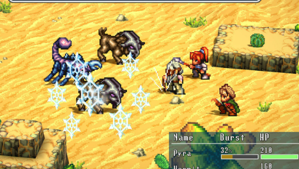
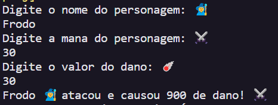

# Criar Personagem de RPG 🧚🧙‍♂️⚔️

Em jogos de RPG, os personagens frequentemente possuem subclasses que representam especializações, como por exemplo, "mago", "guerreiro", etc.

🧚Este programa possui duas classes: "Personagem" e "Especializacoes", onde uma herda atributos da outra.

##

✅ A classe `Especializacoes` herda de `Personagem` e acrecenta o atributo danoBase e o método CalcularDano(), que recebe como argumento a quantidade de mana que será usada no ataque e retorna o dano total causado através do cálculo `{DanoBase * Mana}`

✅ O programa recebe o nome, mana e dano do personagem; e retorna o dano total causado pelo personagem que atacou.

## Saída do programa:

