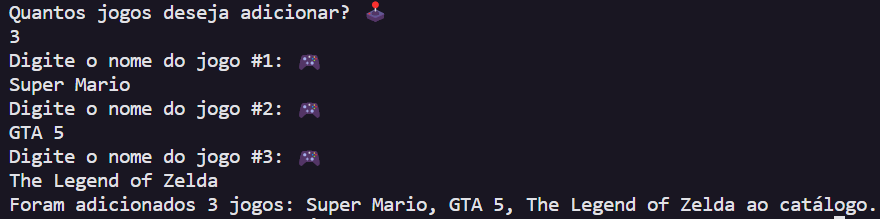

# Gerenciamento de um Catálogo de Jogos 🕹️

O código cria um catálogo de games, permitindo que o usuário adicione uma quantidade específica de jogos, armazenando-os em um array e depois exibindo um resumo.

##

✅ O programa inicia solicitando ao usuário que insira a quantidade de jogos que deseja adicionar. Em seguida, para cada jogo, o user precisa um nome.

✅ Esses dados são armazenados em um array, e o loop `for` facilita essa adição. Após a conclusão, é exibido um resumo indicando a quantidade total de jogos adicionados e seus respectivos nomes.

## Saída do programa:

