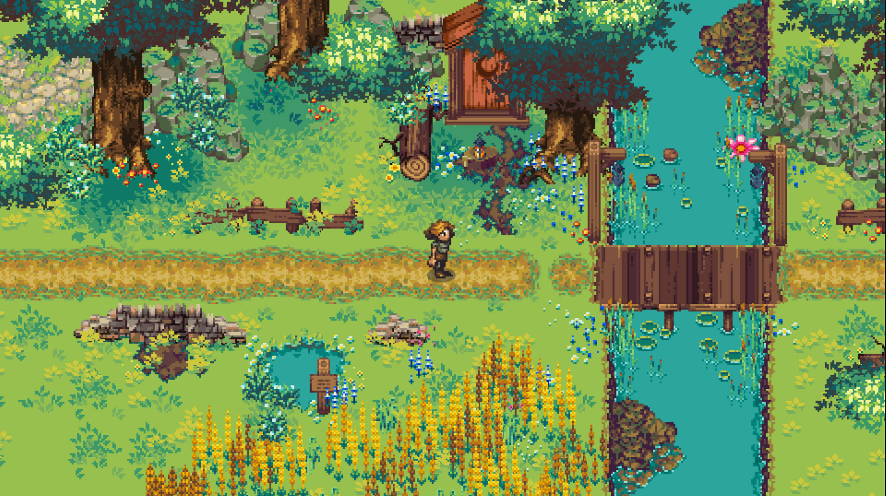
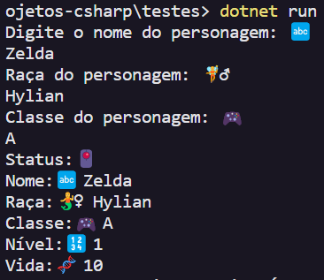

# Criar Personagem de RPG 🧚🧙🎮

O código cria um Personagem de jogo a partir da entrada do usuário e exibe seu status de jogo.

##

✅ A classe `Personagem` contém os atributos nome, raça, classe, nível (inicia em 1), vida (inicia em 10) e mana (inicia em 0). Possui um _construtor_ que recebe como parâmetro o nome, a raça e a classe do personagem.

✅ No fim do código, é chamado o método `ExibirStatus()`, que imprime o Status do personagem contendo seu nome, a raça, a classe, o nível e a vida.

## Saída do programa:

