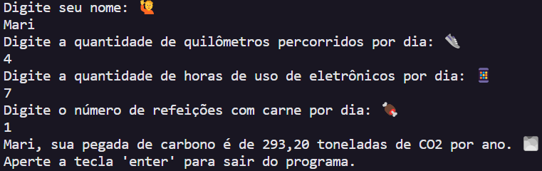

# Cálculo da Pegada de Carbono emitida por pessoa 🌫️

O projeto calcula a quantidade de dióxido de carbono (CO2) emitida anualmente por uma pessoa com base em seu estilo de vida. O cálculo considera a distância percorrida, o uso de eletrônicos e o consumo de refeições com carne.

##

✅ A pegada de carbono do usuário é calculada a partir de três fatores: transporte (quilômetros diários × 365 × 0.2), eletrônicos (horas diárias × 0.1) e consumo de carne (refeições com carne por dia × 0.5). A soma desses valores fornece a pegada de carbono total, abrangendo diversas fontes de emissões.

🚨Curiosidade: A pegada de carbono é uma medida da quantidade de dióxido de carbono (CO2) e outros gases de efeito estufa liberados na atmosfera devido às atividades diárias

## Saída do projeto:

