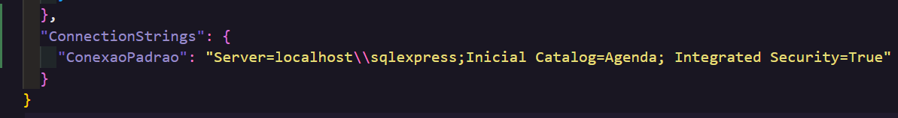
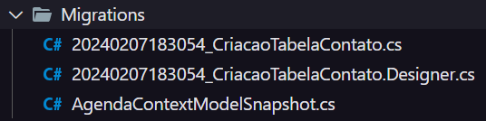
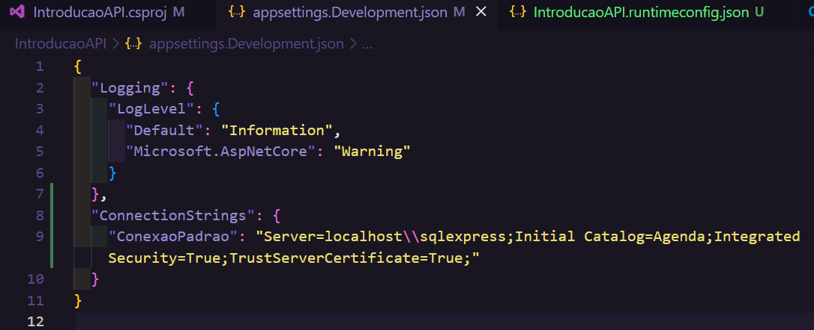
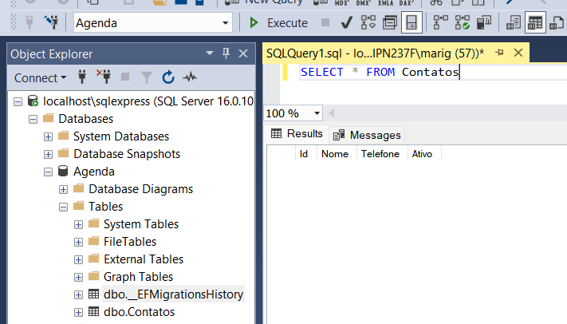
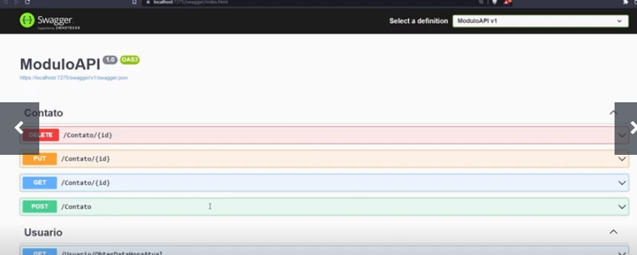
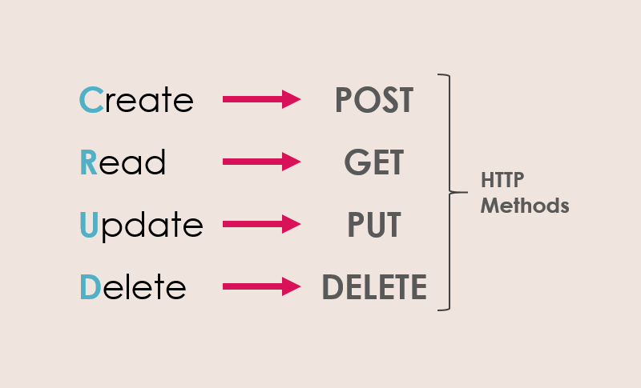
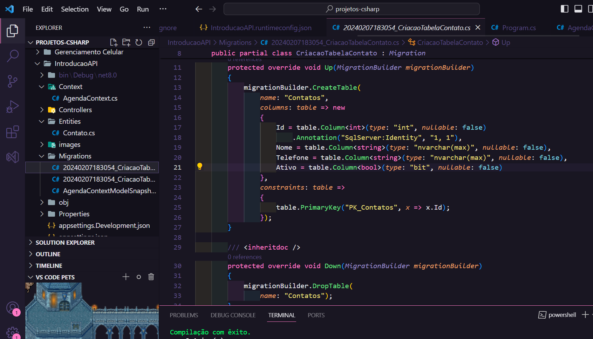

# Entity Framework Core (EF) 🔮

**É uma Framework ORM (Object-Relational Mapping) criado para facilitar a integração com o banco de dados, mapeando tabelas e gerando comandos SQL de forma automática.**

<p align="center"></p>

**UI - User Interface:** pode ser uma tela de cadastro, API, etc. É a tela de interação com o usuário.

**Bussines Layer:** 'Negócios' que podem ser as classes ou contollers. É tudo que faz acesso ao processamento, onde recebe os dados.

**Date Layer:** Camada mais próxima ao banco de dados. Onde está o _Entity Framework_ → responsável por se comunicar com o db e gerar a linguagem SQL.

- Ex: uma classe chamada Clientes em C# e uma tabela chamada Clientes no banco de dados.

Para persistir(armazenar/salvar) dados de um programa C# para um banco de dados deve-se realizar a comunicação da mesma língua do Banco de Dados (SQL).

⏺️ É necessario definir modelos de dados (entidades) no programa C#, as quais representam as tabelas do banco de dados. O EF cria automaticamente as consultas SQL necessárias para realizar operações **CRUD** (Create, Read, Update, Delete) no banco de dados.

## Instalação do Entity Framework Core 📥

🚨 **Importante instalar a ferramente para uso do EF:** comando `dotnet tool instal --global dotnet-ef` no terminal (essa intalação é fixa para poder usar em todos os projetos).

- Você pode invocar a ferramenta usando o comando a seguir: `dotnet-ef`
  A ferramenta 'dotnet-ef' (versão '8.0.1') foi instalada com êxito.

📦 **Pacote Entity Framework:** `dotnet add package Microsoft.EntityFrameworkCore.Design`.

📦 **Pacote SQL Server:** `dotnet add package Microsoft.EnityFrameworkCore.SqlServer`

## Exemplo de uso do Entity Framework para salvar um usuário no banco de dados:

1. Defina uma entidade para representar o usuário no código C#:

```
public class User
{
  public int Id { get; set; }
  public string Nome { get; set; }
}
```

2. Configurar um contexto do Entity Framework que represente a conexão com o banco de dados:

**Context:** uma classe que centraliza todas as informações em determinado banco de dados.

```
publlic class MyContext : DbContext
{
  public DbSet<User> Users { get; set; }

  public MyContext(DbContext<MyContext> options) : base(options)
  {

  }
}
```

`DbSet<User>` porque a classe Users está sendo representada dentro de um objeto e será uma tabela no banco de dados. Assim, é uma **entidade/entity**

`public MyContext(DbContext<MyContext> options) : base(options)` O Context faz a ligação com o banco de dados, primeiro ele recebe uma configuração, passa para a classe pai (DbContext) com ':' e representa uma tabela com o DbSet.

**Entity (Entidade):** é uma classe no programa C# e uma tabela no Banco de Dados.

3. Usar o contexto para adicionar um novo usuário ao banco de dados:

```
class Program
{
  static void Main()
  {
    using (var context = new MyContext())
    {
      var newUser = new User { Nome = "Mariana" };

      context.Users.Add(newUser);
      context.SaveChanges();
    }
  }
}
```

🟣 Essa é uma maneira simplificada de usar o EF para persistir dados em um banco de dados SQL Server usando C#. É importante ajustar a string de conexão SQL de acordo com o ambiente, e configurar corretamente o Entity Framework.

### appsettings.Development.json

Arquivo de configuração json usado para testes e desenvolvimento.



**ConectionStrings:** é uma string de conexão do programa com um banco de dados.

- **"Server=localhost\\sqlexpress** mesmo servidor/conexão do SQL Server utilizado.

- **Inicial Catalog=Agenda** Banco de dados que o programa irá trabalhar.

- **Integrated Security=True** utilizar a própria autêntificação.

### appsettings.json

Arquivo de configuração json utilizado para produção → quando vai implantar este sistema em um ambiente real.

### appsettings.Development.json

Arquivo de configuração json usado para testes e desenvolvimento do programa. → Onde irá adicionar o path do banco de dados utilizado.

## Migrations 🗺️

Mapeamento que o entity faz nas classes para poder transformar os dados em tabelas.

`dotnet-ef migration add CriacaoTabelaContato` dado este comando, será criado a pasta _Migrations_ com três arquivos:



- 1º - A própria Classe → gera um código automático com dois métodos:

  - **Up:** pega a entidade (classe) Contato e a transforma em uma tabela. Aplica mudanças no banco de dados → **criação**
  - **Down:** fazer rollback → deletar dados

- 2º - Designer
- 3º - Snapshot

### Adicionar a Migration 🗺️

No arquivo appsettings.Development.json, adicionar o path do danco de dados:



Catalog=Agenda → vai ser o nome do database.

**`dotnet-ef database update`** comando para aplicar as migrações no banco de dados. → **É uma etapa crucial no processo de migraçãp de bancos de dados no EF, pois garante que a estrutura do banco de dados esteja sincronizada com o modelo de dados do app/api**.

- Dar primeiro o comando `dotnet build` para compilar o programa e verificar se está tudo ok.

Este comando irá adicionar o database do código no banco de dados. No meu caso, usei o SQL Server, então abri o SSMS e dei reload para atualizar e incluir a tabela.

<p align="center"></p>

## CRUD ✍️📖🔄️🗑️

**Create, Read, Update, Delete** - as quatro operações fundamentais em sistemas de gerenciamento de banco de dados e desenvolvimento de software.

- Essas operações são efetuadas em um Controller, onde são criados os **endpoints (métodos) que correspondem às operações CRUD** para disponibilizar na API, e assim é fornecida uma interface para acessar e manipular os dados através do Swagger do comando `dotnet watch run`.

<p align="center"></p>

## HTTP verbs 🌐

Os HTTP verbs (**métodos de requisição HTTP**) são utilizados para indicar a ação que deve ser realizada em um recurso no servidor web. Cada método de requisição http tem um objetivo espeífico:

<p align="center"></p>

- **POST:** CRIAR - usado para enviar dados para o servidor para criar um novo recurso.
- **GET:** LER - usado para solicitar a representação de um recurso.
- **PUT:** ATUALIZAR - atualiza os dados de um recurso.
- **DELETE:** DELETAR - remove um recurso específico do servidor.
- **PATCH:** aplicar modificações parciais a um recurso.

🔵 No contexto de requisições http, um **recurso** é uma entidade ou um objeto identificável em um servidor web que pode ser manipulado por meio dos métodos http.

Esses recursos podem ser diversos, como páginas da web, imagens, arquivos, dados de usuário, registros de banco de dados, entre outros → Cada recurso possui um identificador único (id).

<p align="center"></p>

## Documentação 📄

https://learn.microsoft.com/pt-br/ef/core/get-started/overview/install
