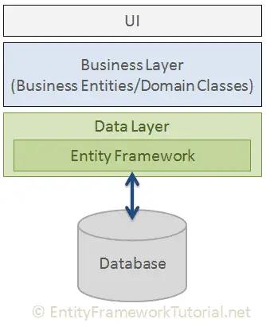

# Entity Framework Core (EF) 🔮

**É uma Framework ORM (Object-Relational Mapping) criado para facilitar a integração com o banco de dados, mapeando tabelas e gerando comandos SQL de forma automática.**

<p align="center"></p>

**UI - User Interface:** pode ser uma tela de cadastro, API, etc. É a tela de interação com o usuário.

**Bussines Layer:** 'Negócios' que podem ser as classes ou contollers. É tudo que faz acesso ao processamento, onde recebe os dados.

**Date Layer:** Camada mais próxima ao banco de dados. Onde está o _Entity Framework_ → responsável por se comunicar com o db e gerar a linguagem SQL.

- Ex: uma classe chamada Clientes em C# e uma tabela chamada Clientes no banco de dados.

Para persistir(armazenar/salvar) dados de um programa C# para um banco de dados deve-se realizar a comunicação da mesma língua do Banco de Dados (SQL).

⏺️ É necessario definir modelos de dados (entidades) no programa C#, as quais representam as tabelas do banco de dados. O EF cria automaticamente as consultas SQL necessárias para realizar operações **CRUD** (Create, Read, Update, Delete) no banco de dados.

## Exemplo de uso do Entity Framework para salvar um usuário no banco de dados:

1. Defina uma entidade para representar o usuário no código C#:

```
public class User
{
  public int Id { get; set; }
  public string Nome { get; set; }
}
```

2. Configurar um contexto do Entity Framework que represente a conexão com o banco de dados:

```
publlic class MyContext : DbContext
{
  public DbSet<User> Users { get; set; }

  protected override void OnConfiguring(DbContextOptionsBuilder optionsBuilder)
  {
    optionsBuilder.UseSqlServer("string_de_conexão_sql");
  }
}
```

3. Usar o contexto para adicionar um novo usuário ao banco de dados:

```
class Program
{
  static void Main()
  {
    using (var context = new MyContext())
    {
      var newUser = new User { Nome = "Mariana" };

      context.Users.Add(newUser);
      context.SaveChanges();
    }
  }
}
```

🟣 Essa é uma maneira simplificada de usar o EF para persistir dados em um banco de dados SQL Server usando C#. É importante ajustar a string de conexão SQL de acordo com o ambiente, e configurar corretamente o Entity Framework.
