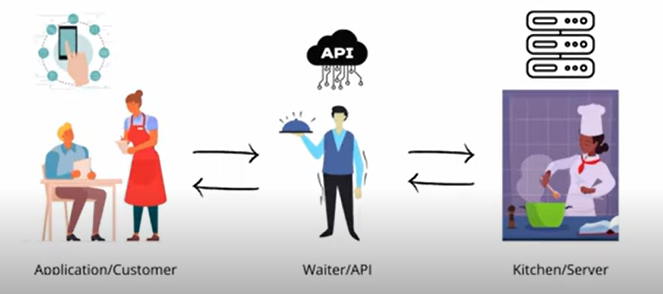
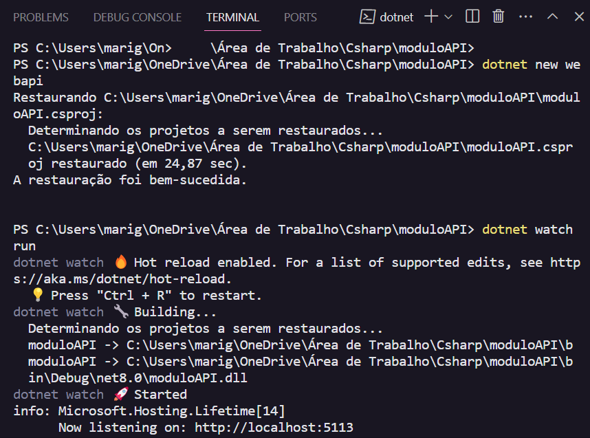

# APIs em C#

**API (Aplication Programming Interface)** - É uma forma de comunicação entre computadores ou programas de computadores. Em outras palavras, é um software que fornece/integra informações para outro software.

## Criação de uma API em .NET no VSCode

`dotnet new webapi` para criar a API, após o comando virá um projeto padrão sobre o clima → como se fosse o “hello world”.

`dotnet watch run` → ao executar esse comando, abrirá um front-end para requisições da api.

**Swegger:** documentação da api que abrirá ao executar _dotnet watch run_ no localhost 5513 do pc.

- Uma API trabalha com requisições http.

**Controller:** uma classe C# que agrupa as requisições http e vai disponibilizar os endpoints.

## Documentação 📄

https://learn.microsoft.com/en-us/aspnet/core/tutorials/getting-started-with-swashbuckle?view=aspnetcore-7.0&tabs=visual-studio
