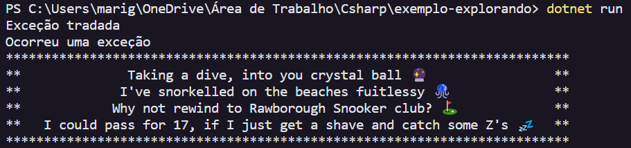

## Leitura de Arquivo .txt 📄

Código que realiza a leitura de um arquivo txt e retorna no terminal os caracteres deste arquivo.

✅ Escrito com as excessões try/catch, para realizar a leitura ou retornar uma mensagem de erro específica (que no caso é de diretório não encontrado) e erro genérico.

✅ Utiliza o loop `foreach` para percorrer cada linha do arquivo e retorná-las no terminal.

🟢 `try/catch` para prevermos uma exceção, usamos duas palavras reservadas, uma na qual define o escopo de execução, e a outra que trata a exceção retornada.

🟢 `throw` para lançarmos uma exception e interromper o fluxo de nosso código.

- Os recursos de manipulação de exceção do cs ajudam a lidar com quaisquer situações de excepcionais ou inesperadas que ocorram quando um programa for executado.

### Saída no terminal:

