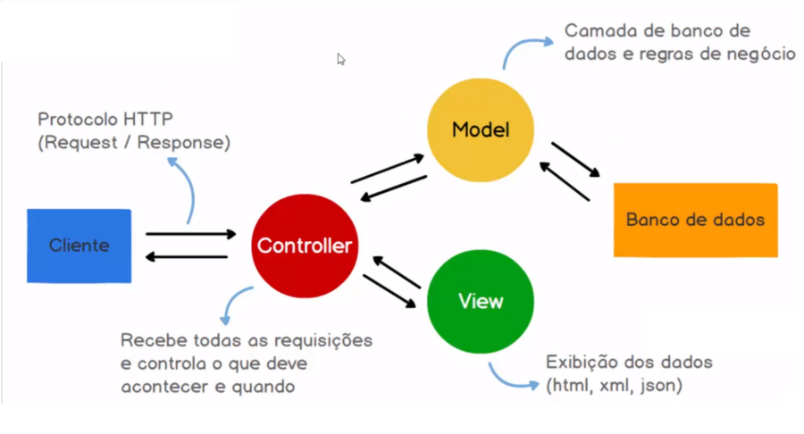

# Model View Controller - MVC

#### O MVC é um padrão de design usado para desacoplar a interface do usuário (a exibição), os dados (o modelo) e a lógica do aplicativo (o controlador). Esse padrão ajuda a obter uma separação das preocupações.

