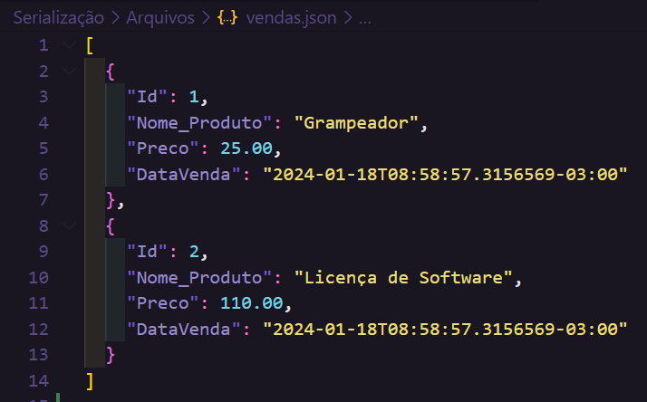
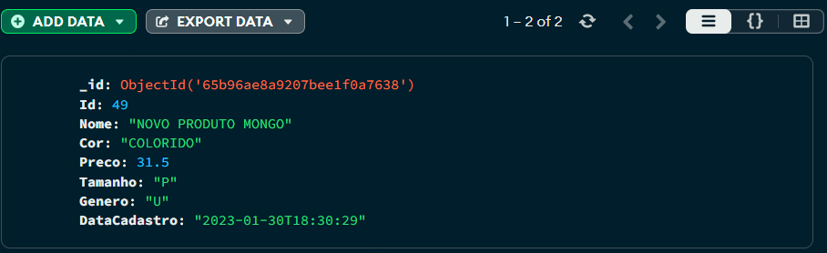

# MongoDB 

🍃**MongoDB** é um tipo de Banco de Dados não Relacional, onde os dados não são armazenados em tabelas, mas sim de forma semi-estruturada (no caso do mongo), sendo orientado a **documentos** em formato **JSON**.

- O MongoDb cria automaticamente um "id" interno para cada documento (registo) da coleção (tabela), chamado de `_id`.

## Diferenças de nomes entre MongoDB e SQL Server

| SQL Server 🗄️  | MongoDB 🍃 |
| -------------- | ---------- |
| Tabela         | Colection  |
| Linha/Registro | Document   |

## Comandos MongoDB 🍃

- Comandos para utilizar no **mongosh** → shell do _MongoDB Compass_ ou no CMD (Prompt de Comando) com o path do _mongod_ instanciado no terminal.

| Comando 🖲️                                             | Descrição 📝                                                    |
| ------------------------------------------------------ | --------------------------------------------------------------- |
| mongosh                                                | Conectar a um servidor mongo no CMD                             |
| show databases(dbs)                                    | Listar os bancos de dados                                       |
| use nome_do_banco_de_dados                             | Selecionar um banco de dados                                    |
| show collections                                       | Listar as coleções (tabelas)                                    |
| db.nome_da_colecao.insertOne({JSON})                   | Cria um novo documento                                          |
| db.nome_da_colecao.find({condição JSON})               | Faz uma busca nos documentos de acordo com a condição           |
| db.nome_da_colecao.find({}).sort({condição 1 ou -1})   | organiza em ordem crescente(1) ou decrescente (-1)              |
| db.nome_da_colecao.updateOne({condição},{$set:{JSON}}) | Atualiza um documento conforme a condição e o novo dado passado |
| db.nome_da_colecao.deleteOne({condição})               | Deleta um documento                                             |
| db.nome_da_condicao.deleteMany({condição})             | Deleta mais de um documento                                     |
| $lte                                                   | menor ou igual a                                                |
| $set                                                   | Usado em conjunto com o comando updateOne                       |
| db.stats()                                             | Mostrar estatísticas do servidor                                |
