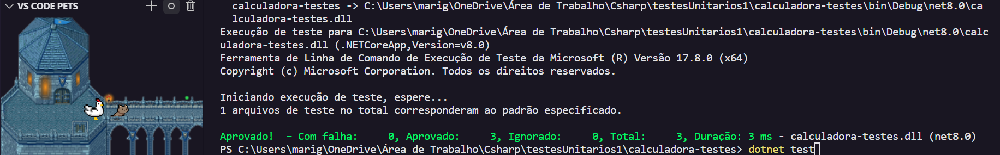

# Projetos Desenvolvidos em Linguagem 

#### Projetos e códigos desenvolvidos durante meus estudos de csharp.

| Programa 👾                                                                                                            | Descrição 🤖                                                                                                     | Conceitos ✅                             |
| ---------------------------------------------------------------------------------------------------------------------- | ---------------------------------------------------------------------------------------------------------------- | ---------------------------------------- |
| [Conceitos Básicos](https://github.com/maalcantara/projetos-csharp/tree/main/Conceitos%20B%C3%A1sicos)                 | Conceitos fundamentais e como instanciá-los em C#.                                                               | Fila, Pilha e Loops                      |
| [Cadastro Pessoa](https://github.com/maalcantara/projetos-csharp/tree/main/Cadastro%20Pessoa)                          | Código C# que implementa atributos e métodos para exibir um resumo do cadasto de uma pessoa.                     | Orientação a objetos                     |
| [Calculo Pegada Carbono](https://github.com/maalcantara/projetos-csharp/tree/main/C%C3%A1lculo%20Pegada%20Carbono)     | Código C# que calcula a emissão de CO2 de uma pessoa com base em seu estilo de vida.                             | Manipular métodos (funções)              |
| [Catálogo de Jogos](https://github.com/maalcantara/projetos-csharp/tree/main/Cat%C3%A1logo%20de%20Jogos)               | Código C# que permite a adição da quantidade de jogos e seus nomes, exibindo um resumo com esses dados.          | Array e Listas                           |
| [Controle Velocidade Robô](https://github.com/maalcantara/projetos-csharp/tree/main/Controle%20Velocidade%20Rob%C3%B4) | Código C# que permite controlar a velocidade com base em comandos fornecidos pelo usuário.                       | Propriedades e Métodos                   |
| [Criar Personagem RPG](https://github.com/maalcantara/projetos-csharp/tree/main/Criar%20Personagem%20RPG)              | Código C# que implementa atributos para exibir o staus do personagem.                                            | Métodos e Construtores                   |
| [Batalha RPG](https://github.com/maalcantara/projetos-csharp/tree/main/Batalha%20RPG)                                  | Código C# que possui uma classe herdeira da outra e calcula o dano total causado pelo personagem.                | Herança e Subclasses                     |
| [Ler Arquivo](https://github.com/maalcantara/projetos-csharp/tree/main/Ler-Arquivo)                                    | Código C# que usa exeptions para a leitura de um arquivo txt externo.                                            | Try, Catch e Throw                       |
| [Sistema Estacionamento](https://github.com/maalcantara/projetos-csharp/tree/main/SistemaEstacionamento)               | Projeto C# que implementa um Sistema de Estacionamento com funcionalidades gerenciadas pelo terminal.            | Orientação a objetos, loops e métodos    |
| [Gerenciamento Celular](https://github.com/maalcantara/projetos-csharp/tree/main/Gerenciamento%20Celular)              | Projeto C# que implementa um Sistema de cadastro de Smartphones seguindo os principios poo.                      | Orientação a objetos e classes abstratas |
| [Testes Unitários](https://github.com/maalcantara/projetos-csharp/tree/main/Testes%20Unit%C3%A1rios)                   | Projeto C# que implementa validações e testes unitários em suas classes através da extenção Solutions do VScode. | Testes Unitários xunit                   |
| [Testes Unitários 2](https://github.com/maalcantara/projetos-csharp/tree/main/Testes%20Unit%C3%A1rios)                 | Projeto C# que implementa mais validações e testes unitários em listas de arrays e strings.                      | Testes Unitários xunit                   |

##

