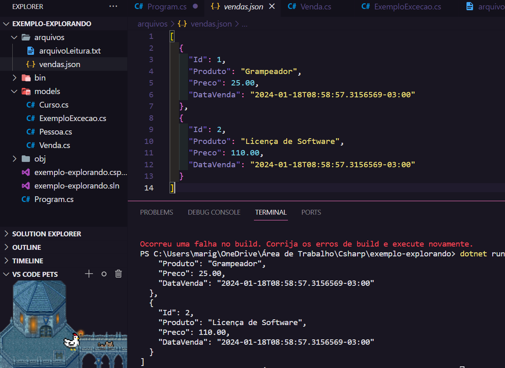

# NuGet e Serialização 🪄

Instalar pelo nuget (gerenciador de pacotes) a bliblioteca [Newtonsoft.Json](https://www.nuget.org/packages/Newtonsoft.Json) com o comando `dotnet add package Newtonsoft.Json` no terminal.

A serialização do objeto por essa biblioteca é feita a partir do método `JsonConvert.SerializeObject()`. Esse comando transforma o objeto instanciado no formato Json.

## Serialização 📤

Para transportar um objeto em c# é necessário serializar o código, que consiste no processo de transformar o objeto em formato json e assim exportá-lo.

- É o processo de converter um objeto ou estrutura de dados em um formato que possa ser transportado ou armazenado. Em c#, isso envolve a transformação de um objeto em uma representação de texto no formato JSON ou XML.

- A serialização é útil quando há o caso de enviar dados pela rede, armazená-los em ou arquivo ou banco de dados, ou quando é necessário compartilhar dados entre != partes de um programa.

## Desserialização 🖨️

Processo inverso da serialização, consiste em importar o arquivo JSON, entender o conteúdo desse arquivo (suas propriedades, tipos e formatos) e mapeá-lo em uma classe com essas propriedades e na main ler este texto e escrevê-lo com um loop foreach.

- É o processo de converter um JSON de volta para um objeto ou estrutura de dados. Atenção ao mapear as propriedades na classe com o nome correto!!

- Caso o arquivo em JSON venha com alguma propriedade que não se adéque à convenção da linguagem, é possível utilizar **atributos** → na hora de mapear as propriedades na classe, usar o método `[JsonProperty("Nome_da_Prop")]`
  e abaixo declarar o propriedade com o nome adequado. (exemplo na linha 15 do arquivo Venda.cs)

**Atributo:** refere-se a uma chave ou nome associado a um valor dentro de um objeto JSON.

## Tipos Especiais → Null Type ❓

O valor null (nulo) é um valor vazio. Para declarar uma variável que pode receber um valor nulo, adicionar **?** no tipo da variável. Exemplo: `public decimal? valor`.

- No programa de exemplo, há uma propriedade no json que pode ou não receber um valor. Dessa forma, o construtor desta prop tem `?` para indicar que essa variável pode receber um valo nulo. Na linha **15** do arquivo `Program.cs` há um operador ternário para identificar se essa propriedade possui um valor e caso positivo, mostrá-lo no terminal.

## Documentações 📄

**Biblioteca Newtonsoft.Json:** https://learn.microsoft.com/pt-br/dotnet/standard/serialization/

**Serialização:** https://learn.microsoft.com/pt-br/dotnet/standard/serialization/

**Site para validar um formato JSON:** https://codebeautify.org/jsonviewer

## Saída do código 🚨

