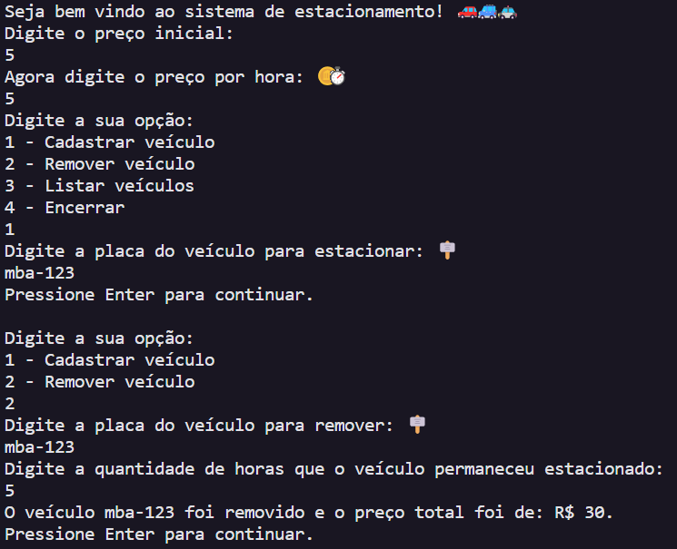

# Sistema de Estacionamento 🅿️🚙

Projeto em C# que implementa um Sistema de Estacionamento com um menu de opções gerenciadas pelo terminal através de orientação a objetos, loops e manipulação de métodos.

🪧 Este Sistema gerencia os veículos estacionados e realiza suas operações, como por exemplo, adicionar um veículo, remover um veículo (e exibir o valor cobrado durante o período) e listar os veículos.

## Sobre 🚗

✅ A classe `Estacionamento` possui as variáveis 'precoInicial', 'precoPorHora' e 'veiculos' que armazenam os valores dados pelo usuário para posterioemente aplicá-los no cálculo.

✅ Também possui três métodos: 'AdicionarVeiculo', 'RemoverVeiculo' e 'ListarVeiculos' que funcionam após o comando do usuário no terminal. O método `RemoverVeiculo` solicita a placa digitada, depois as horas que o veículo permaneceu estacionado e por fim devolve o cálculo do valor total a se pagar.

## Saída do programa: 🚨

🛑 Aprimoramento do projeto proposto pela https://www.dio.me/en
