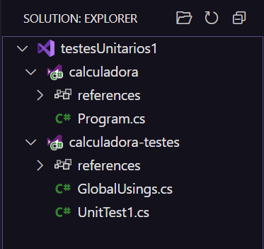
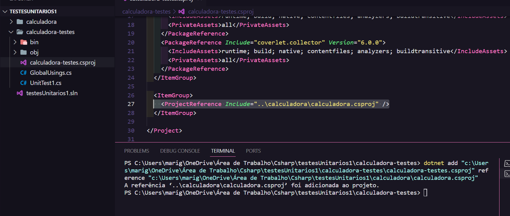
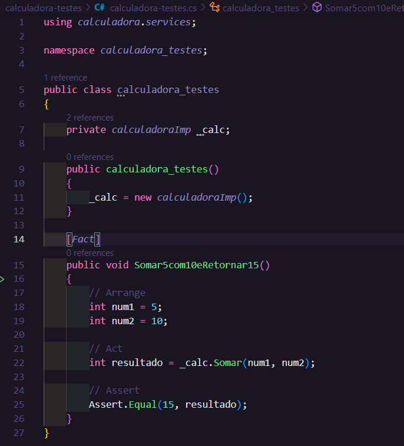
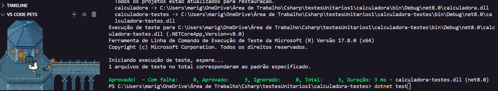

# Testes Unitários em C#

Os testes são fundamentais para garantir a **qualidade** e o funcionamento correto de um software. Serve principalmente para validar se o que foi construído está atendendo ao que se é esperado.

## Teste Unitário 📝

Teste unitário (ou teste de unidade) são testes realizados diretamente no código fonte, buscando testar a menor unidade de código possível, através de cenários que podem ocorrer no sistema.

**Exemplo:** um user do sistema só é cadastrdo se tiver um CPF e um email válido. Caso contrário, retornará um erro indicando o que está errado.

- Possíveis casos de teste:
  - Usuário com todos os dados válidos;
  - Usuário com CPF inválido;
  - Usuário com email inválido.

## Como executar Testes Unitários em C# ⚙️

💡Passo a passo executado com exemplo do teste commitado.

- Criar dois projetos:
  - Projeto principal → implementação.
  - Projeto de teste → em **xunit**.
- dentro do diretório de testes, executar `dotnet new xunit` no terminal.
- extensão **Solution** do VScode:
  
- add reference → significa que o teste reconhece a implementação.

- Implementar o projeto `calculadora` e instanciar a classe.

### Cenário de testes:

- 1º cenário de testes: `UnitTest1.cs` (renomeado neste exemplo para calculadora-testes.cs).
- importar a classe calculadoraImp (using calculadora.services)

- **[Fact]**: iniciar cenário de teste → um método que valide aquele cenário.
  - **Arrange:** montar o cenário (declarar variáveis).
  - **Act:** executar a ação.
  - **Assert:** passar o resultado esperado → validação do resultado.
    - Assert.Equal(resultado esperado, valor atual/retornado).

## Executar testes

- Abrir o diretório principal do projeto.
- `dotnet test`

