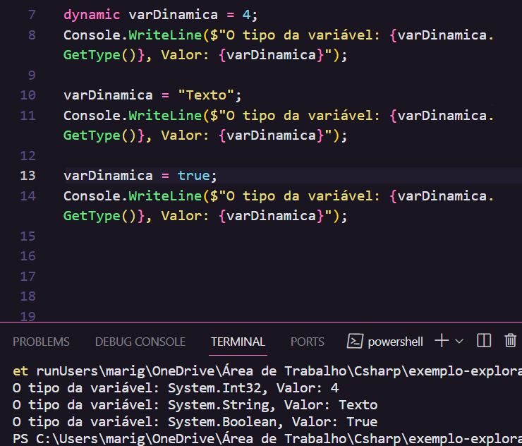
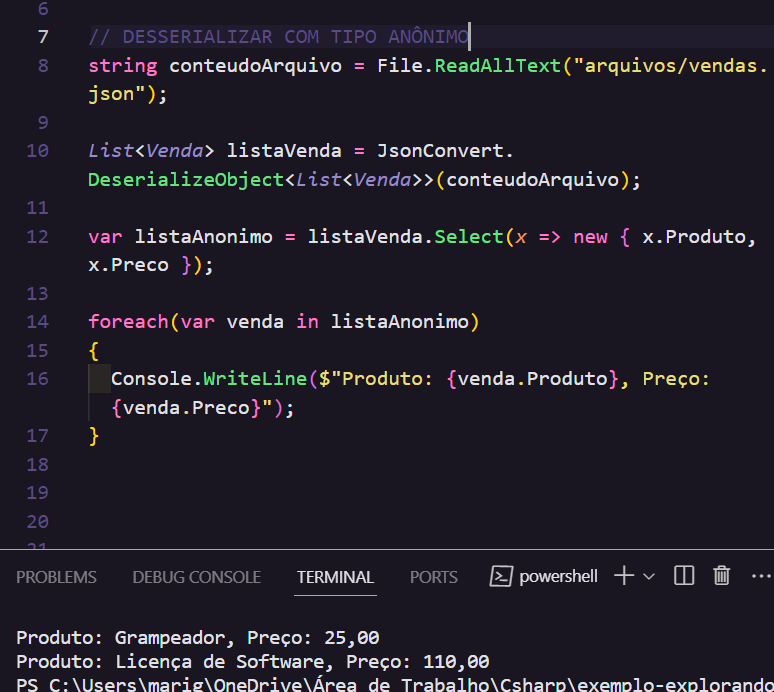
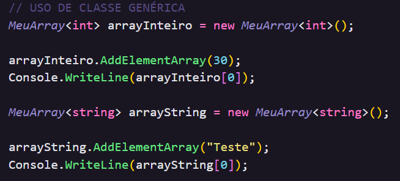
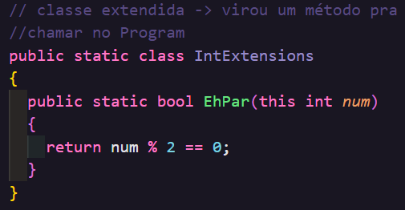
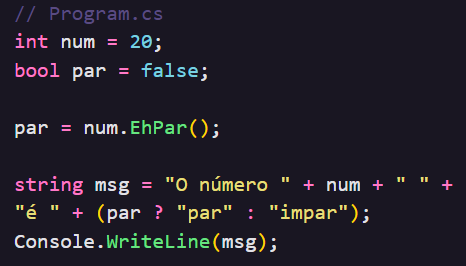

# Tipos Especiais em C#

Em c#, o termo "tipos especiais" não é bem uma categoria oficial ou técnica de tipos de dados. Entretanto, esses tipos são considerados especiais devidos às suas características únicas ou ao seu uso específico. Sendo eles:

- [Object](#object-e-dynamic-🔀)
- [Dynamic](#object-e-dynamic-🔀)
- [Var](#var-e-void-🌀)
- [Void](#var-e-void-🌀)
- [Null](#null-type-❓)
- [Anonymous](#anonymous-type)
- [Generic](#generic-type-💊)
- [Extension Methods](#extension-methods)

## object e dynamic: 🔀

**object:** é a base de todos os tipos em c#. Pode armazenar qualquer valor, pois é uma referência para qualquer tipo.

**dynamic:** permite que o tipo seja decidido em tempo de execução, fornecendo uma flexibilidade maior em relação ao object. → Permite alterar o tipo de variável conforme vou atribuindo um valor a ela.

<p align="center">
  
</p>

## var e void 🌀

**var:** é uma infência de tipo, ou seja, o tipo dessa variável é determinado pelo complidador com base no valor atríbuido à ela.

**void:** indica que o método não retorna nenhum valor.

## Null type ❓

Um tipo de valor null (nulo) permite representar o valor da variável e adicionalmente, o valor nulo. Adicionar `?` no tipo da variável indica que a mesma pode receber um valor nulo.

```
bool = true, false;
bool? = true, false, null;
```

❔O null type pode estar atribuído a propriedades, como por exemplo, fazer a desserialização de um arquivo json de objetos que contém propriedades, e uma dessas propriedades pode ter ou não um valor atribuído a ela. Dessa forma, ao mapear essa classe, adicionar `?` na propriedade respectiva.

## Anonymous type 👤

- Transformar propriedades em <u>somente leitura</u> → { get; }

Criação de uma variável do tipo List onde apenas as informações Produto e Preco serão selecionadas através do método Select e de uma outra var também do tipo List que contém todas as infos deserializadas de um arquivo json:

`var listaAnonimo = listaVenda.Select(x => new { x.Produto, x.Preco});`

**.Select** faz a seleção de um novo tipo de dado. **x** representa um elemento da lista. **{ }** representa o tipo anônimo, e dentro dele, obtenho o produto e o preço → assim criando um novo objeto/coleção de tipos anônimos.

<p align="center">
  
</p>

## Generic type 💊

As classes genéricas encapsulam operações que não são específicas de um determinado tipos de dados.

`List<tipo> lista = new List<tipo>()`

- código flexível e reaproveitável para vários tipos de dados, não dependendo de um tipo de dados.
- **o comportamento da classe genérica é sempre igual, o que muda é o seu tipo.**
- eu declaro a classe de uma forma genérica(T) e na hora de instânciá-la eu declaro seu tipo.

<div style="display: flex; justify-content: center;">
  
  
</div>

## Extension Methods ✈️

Os métodos de extensão permitem que você "adicione" tipos existentes sem criar um novo tipo derivado, recompilar ou, caso contrário, modificar o tipo original. Eles são úteis para estender funcionalidades de classes que você não pode modificar diretamente.

<div style="display: flex; justify-content: center;">
  
  
</div>

##

[Pasta no Notion sobre Tipos Especiais 📒](https://transparent-creator-48b.notion.site/Tipos-Especiais-em-C-964050c7c3b440da9da92def1253dd1a?pvs=4)
