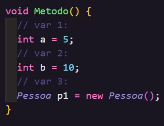
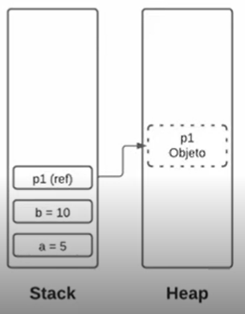
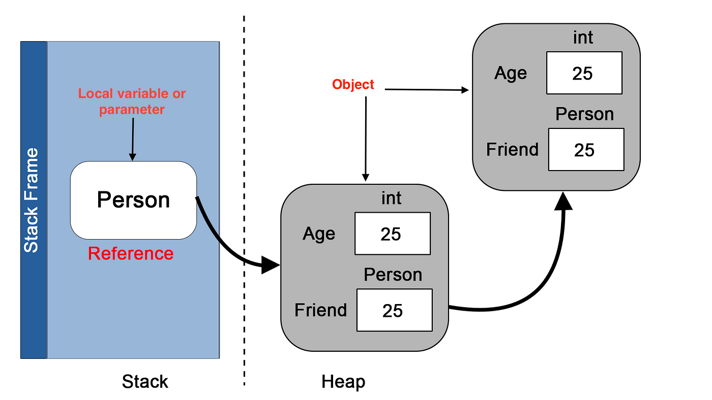
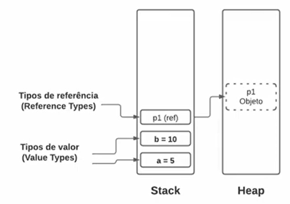
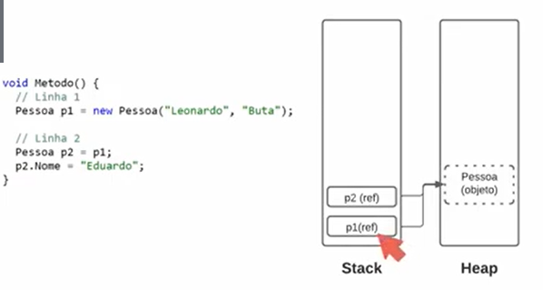
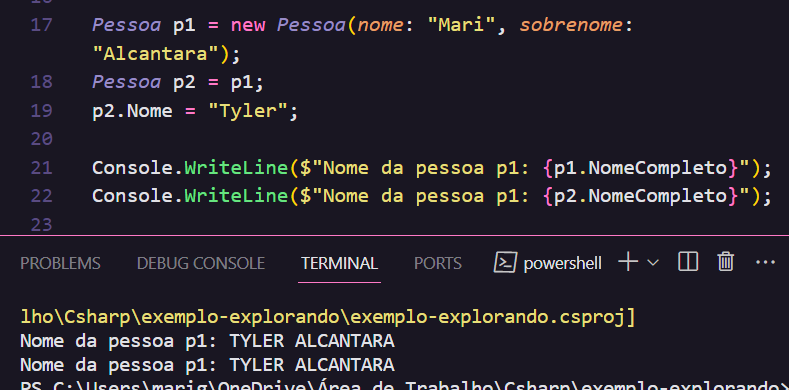

# Tipos de Memória do 

Este conteúdo é mais conceitual e não utilizei muito código para desenvolvê-lo. Todavia, entender os tipos de memória do C# é muito importante para devs, pois influencia diretamente o comportamento e a eficiência de seus programas.

## Alocação de memória 🧠

Há dois tipos de memórias existentes em C# - a **stack** e a **heap**. No entento, é importante primeiro compreender o processo de declaração de uma variável:

  
  

**1º - Tipo de variável:** int, string, decimal, float, var, bool, etc.

**2º - Nome da variável**.

**3º - Valor atribuído à variável**.

- Dependendo do tipo de variável, ela vai ser encaixada em um ou outro tipo de memória.

## Memórias Stack e Heap

| Aspecto           | Stack 🔋                                                                      | Heap 🧠                                               |
| ----------------- | ----------------------------------------------------------------------------- | ----------------------------------------------------- |
| **Natureza**      | Estático                                                                      | Dinâmico                                              |
| **Armazena**      | Objetos mais simples                                                          | Objetos mais complexos, como classes e instâncias     |
| **Conteúdo**      | Variáveis locais, temporárias e ponteiros para objetos na memória heap        | Verdadeira representação e o objeto em si             |
| **Gerenciamento** | Remoção em Pilha (LIFO)                                                       | Remoção em [Garbage Collector](#garbage-collector-🗑️) |
| **Funcionamento** | Armazena e remove variáveis em forma de pilha                                 | -                                                     |
| **Armazenamento** | Vai direto para a memória RAM, armazenando o tipo de valor e o espaço ocupado | -                                                     |
| **Objetos**       | Em objetos, armazena o nome da variável e uma referência para o **heap**      | -                                                     |

## Comunicação entre Stack e Heap 📟

- Ocorre através de ponteiros ou referências.

Há uma comunicação entre as duas memórias. No caso da declaração de objetos, ele vai ser criado na memória stack e armazenado o valor da sua variável em uma referência/link/ligação para o próprio objeto que está representado na memória heap ⇒ ou seja, **no caso de objetos, a memória stack é um ponteiro para o objeto que está sendo representado na memória heap.**

## Limpeza de Memória 🧼🧹🗑️

Após a conclusão de um método, a limpeza da memória inicia-se em formato de pilha na Stack. No Heap, a gestão da memória é realizada pelo garbage collector.

### Garbage Collector 🗑️

O Garbage Collector é responsável por limpar todos os dados na memória heap que não possuem referência de variáveis em uso.

**Exemplo:** Ele verifica se "p1 possui alguma ligação com a memória stack". Se não, isso significa que o método já foi finalizado e removido da memória stack, não havendo mais uma ligação. Nesse caso, o objeto p1 é removido da memória heap porque não está mais em uso.

## Tipos de Valor e Referência 📤

**Tipo de valor:** uma variável de um tipo de valor contém uma instância de tipo. Ela é mais simples → armazena seu valor nela mesma, na memória stack sem ter que consultar outra memória.

**Tipo de referência:** uma variável de um tipo de referência contém uma ligação a uma instância do tipo. Esse tipo é mais complexo → a memória stack armazena seu nome e referência (que aponta o conteúdo) e seu real conteúdo está na heap.

## Cuidados na hora de declarar valores de referência 🚨

Ao manipular valores de referência em C#, é importante estar atento ao compartilhamento de referência. Diferente do tipo de valor, a cópia de uma variável de referência **não cria uma entidade independente, mas sim uma ligação do mesmo objeto**.

- Isso significa que alterar uma variável de referência pode afetar outras que apontam para o mesmo objeto.

### Exemplo:

Essa modificação/cópia está errada, pois em tipos complexos, se você altera um tipo, automaticamente altera todos os tipos.

- Neste exemplo, se você copia p1 pra p2 e só altera p2, o p1 vai ser mudado também porque as duas variáveis apontam para o mesmo objeto.

## Documentação 📄

https://dev.to/gweaths/c-stack-heap-6j6#:~:text=The%20Stack%20is%20the%20part,Value%20type%20and%20Reference%20types.

https://andresantarosa.medium.com/heap-stack-e-garbage-collector-um-guia-pr%C3%A1tico-para-o-gerenciamento-de-mem%C3%B3ria-no-net-3faf6c4cd0ed

https://drive.google.com/file/d/1jbqXs4V4S0OtgETns3snUs5sDGqdoOVM/view
